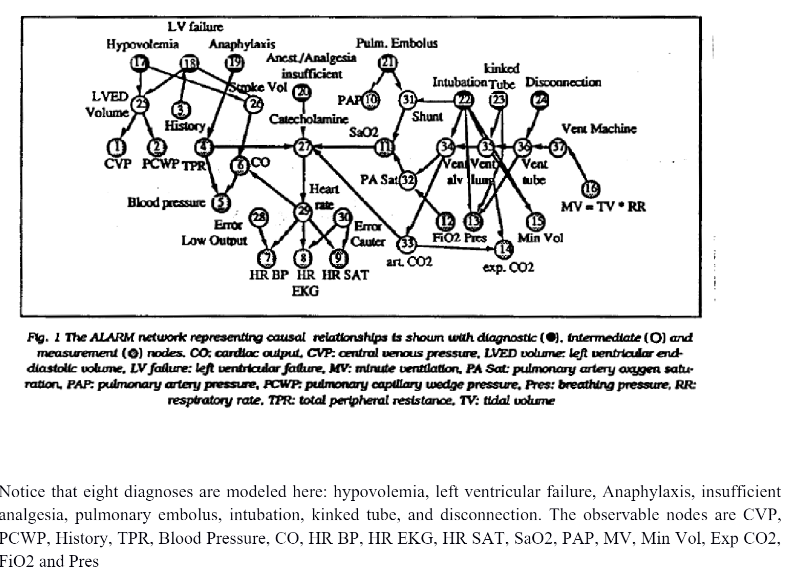

# Medical Diagnosis (Bayesian Network Learning)

### Goal: The goal of this assignment is to get experience with learning of Bayesian Networks and understanding their value in the real world.
#### Scenario: Medical diagnosis. Some medical researchers have created a Bayesian network that models the inter-relationship between (some) diseases and observed symptoms. Our job as computer scientists is to learn parameters for the network based on health records. Unfortunately, as it happens in the real world, certain records have missing values.  We need to do our best to compute the parameters for the network, so that it can be used for diagnosis later on. 
#### Problem Statement: We are given the Bayesian Network created by the researchers. The network is shown below:

#### Such networks can be represented in many formats. We will use the .bif format. BIF stands for Bayesian Interchange Format. The details about the format are here. We are also providing a .bif parser so that you can start directly from a parsed Bayesian network represented as a graph. The goal of the assignment is to learn the Bayes net from a healthcare dataset

For more detailed problem statement, please go through this [pdf](./A4.pdf)

Note : This program was written to complete the coursework requirements of Artificial Intelligence course [COL333](https://www.cse.iitd.ac.in/~mausam/courses/col333/autumn2023/)
